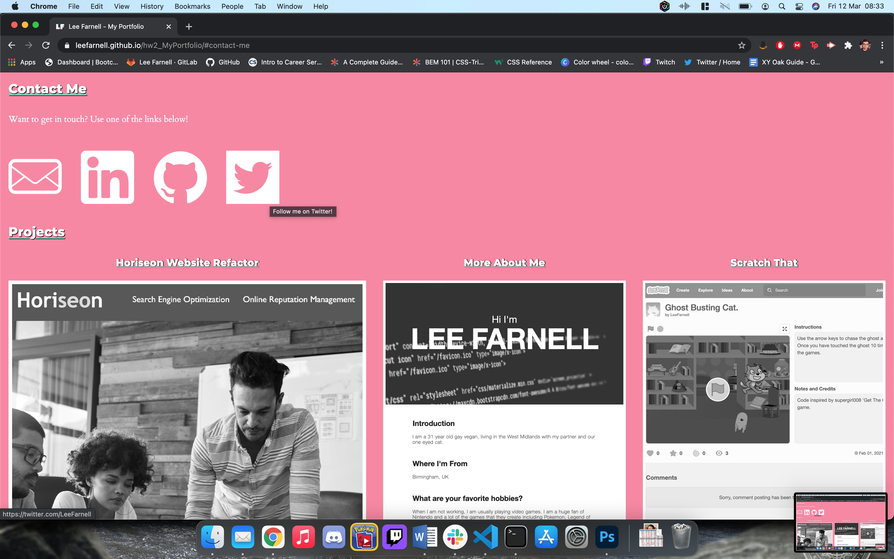

## My Portfolio.

The work you are looking at is my new portfolio. As part of the Coding BootCamp, I was tasked with a user story to create a working portfolio which will display my projects and work both from the BootCamp and beyond.

In order to meet the necessary criteria from the user story, I had to ensure my portfolio included the following:

- My name and a recent photo.
- A working Nav Bar with links to different sections of the page.
- Various contact details
- Titled images of the projects I have been worked on.
- Meeting image size requirements.
- Ensuring my webpage is responsive to various screen sizes e.g. mobile phones, tablets.
- Ensuring my code follows best practices when it comes to naming conventions and file structures.

This portfolio is a work in progress, so there is more to come as the course continues.

## Link to deployed application

https://leefarnell.github.io/hw2_MyPortfolio/

## Screenshots

